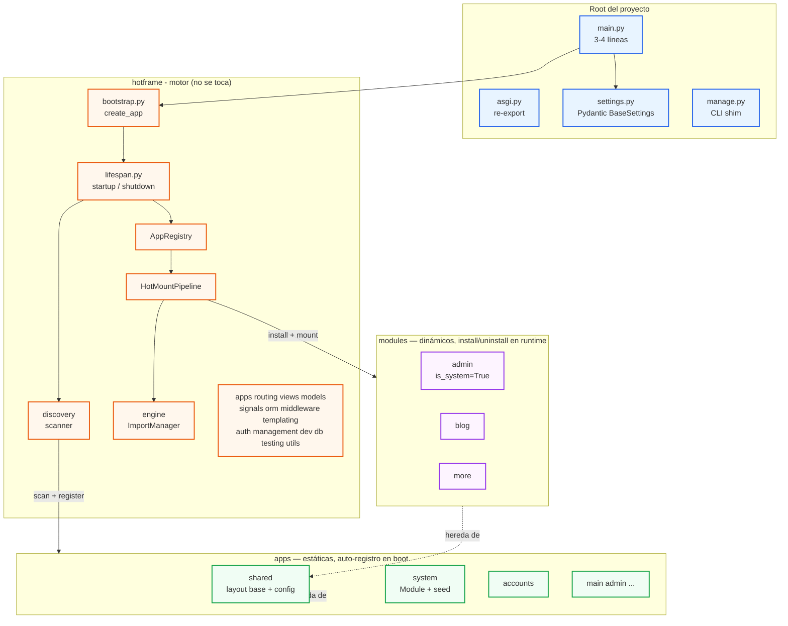
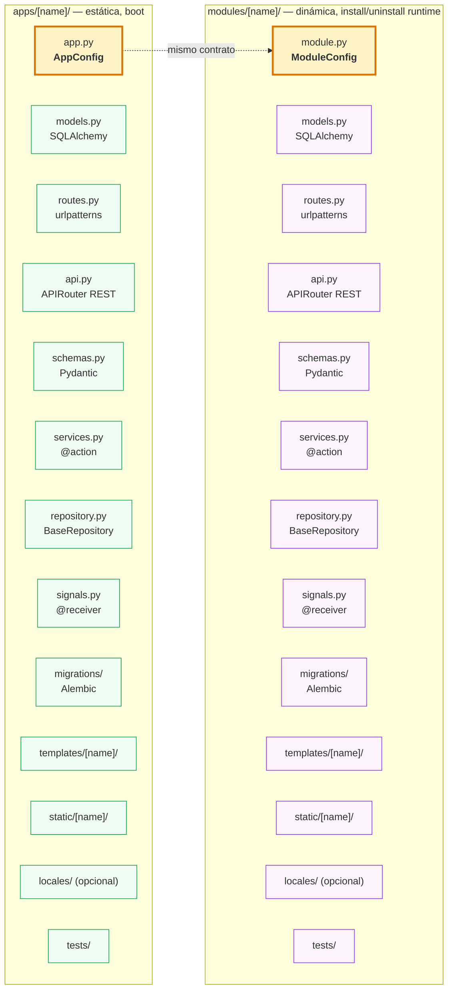
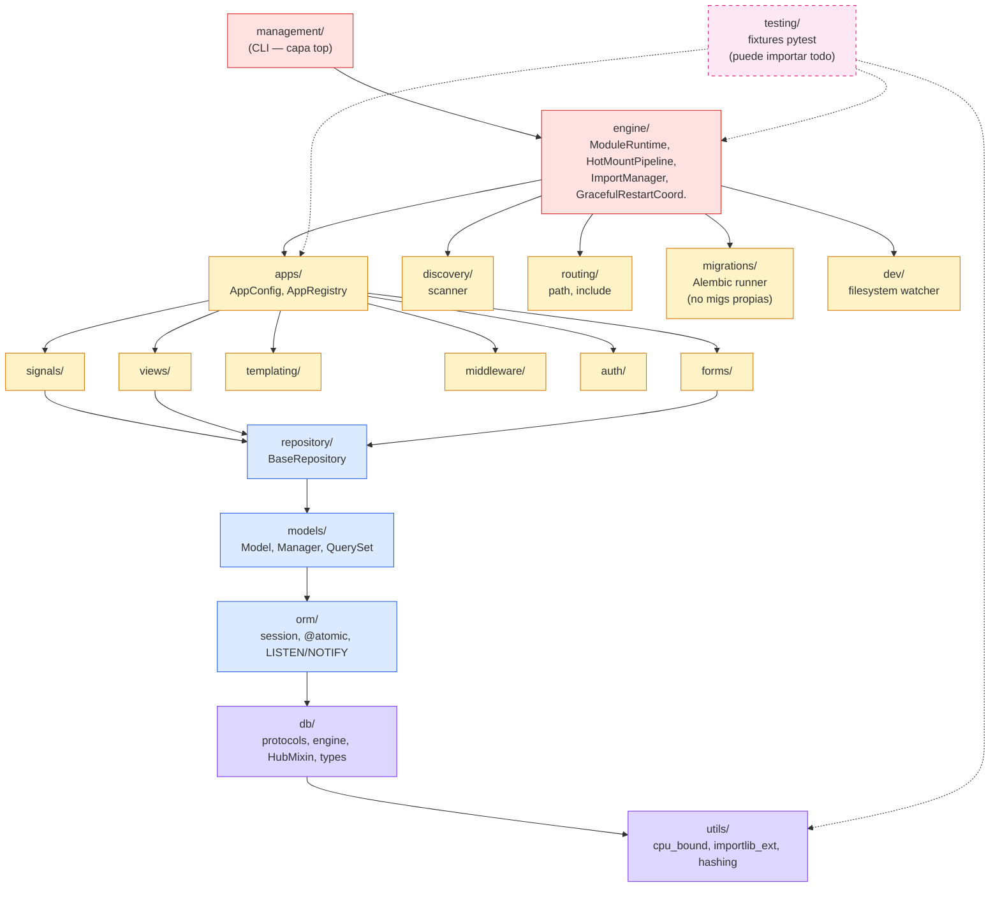
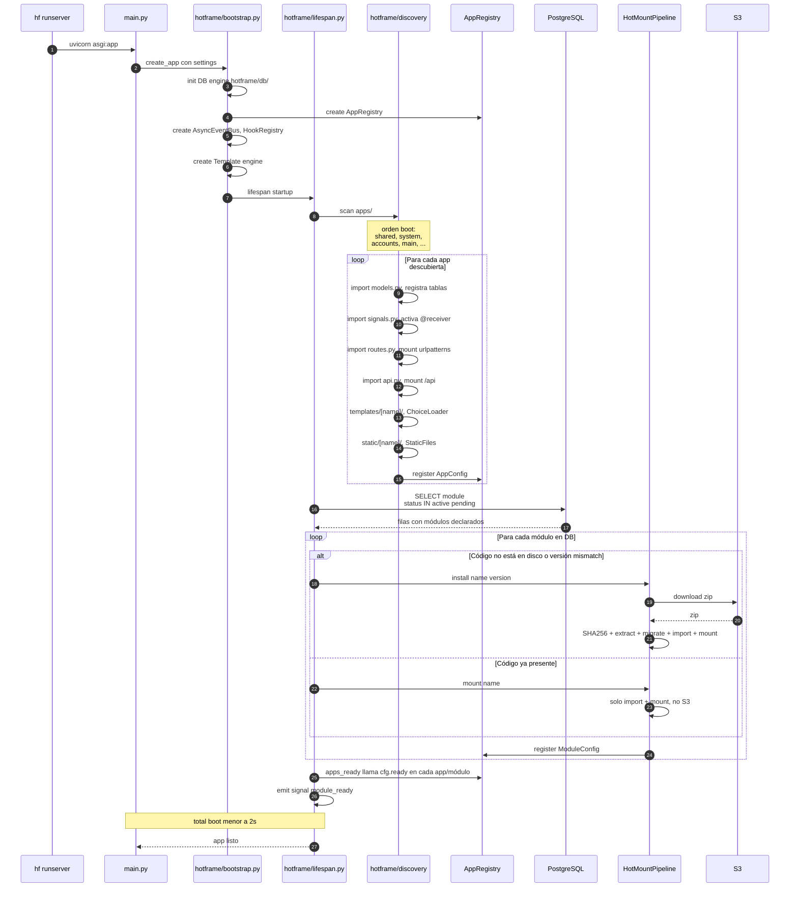
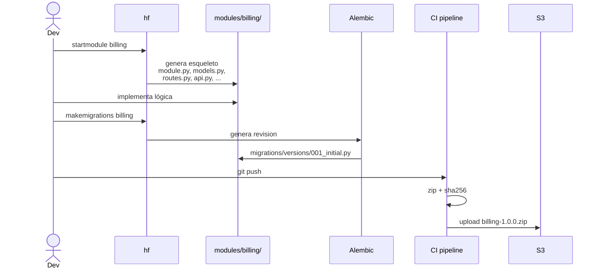
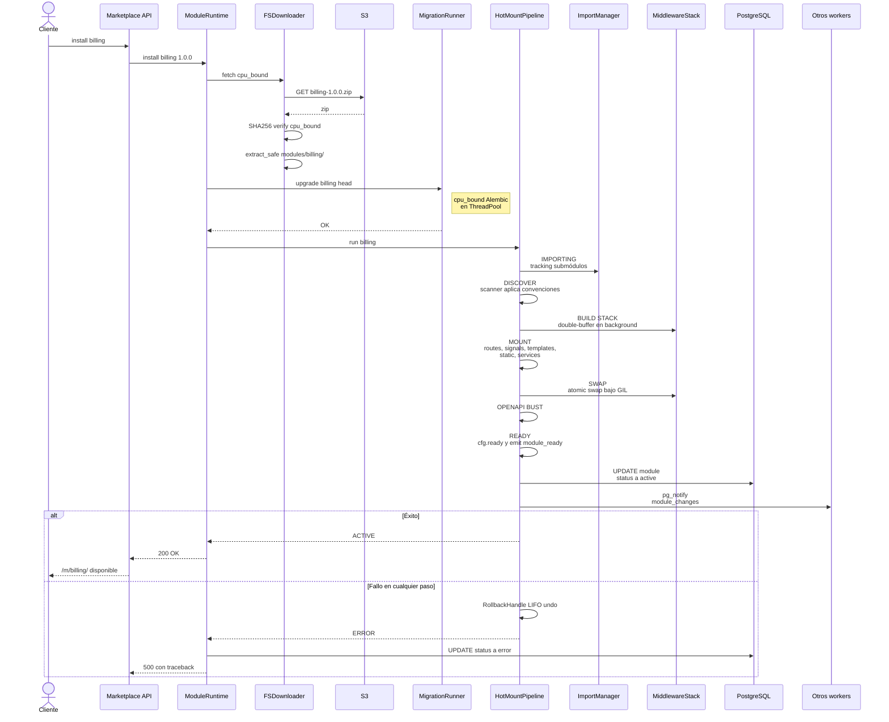
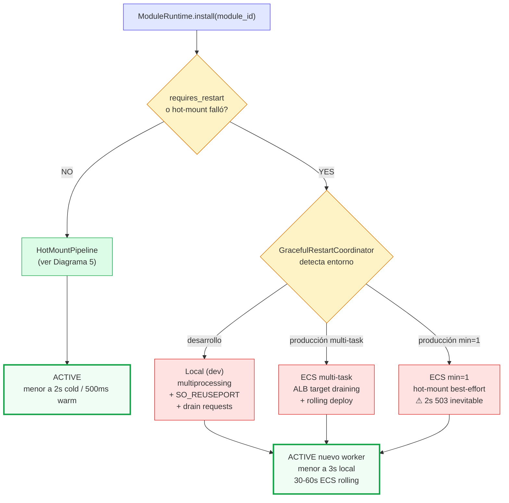
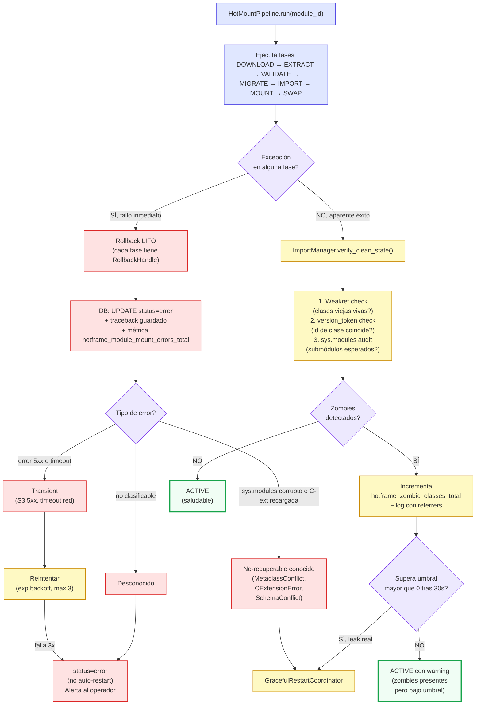

# Hotframe Architecture

Este documento describe la arquitectura final de `hotframe`, un toolkit Python para construir aplicaciones web modulares con hot-mount dinámico de módulos.

---

## Qué es hotframe

`hotframe` es un framework Python que unifica **FastAPI + SQLAlchemy + Alembic + Jinja2 + HTMX + Alpine.js + Typer** bajo una ergonomía Django-like, añadiendo un motor de **hot-mount dinámico de módulos** (carga/descarga de plugins sin reiniciar el proceso).

### Inspirado en

| Sistema | Qué tomamos |
|---------|-------------|
| Django | `AppConfig`, `manage.py`, sistema de apps, scaffolder `startapp`/`startproject`, convenciones de layout |
| Rails Turbo | Frames nombrados, Turbo Streams, morphing, broadcasting por topic |
| Laravel Livewire | Server-driven UI, decoradores de vista, validación inline |
| Odoo | Registry de módulos en DB como fuente de verdad, dependencias con topological sort |
| WordPress | Plugins con hooks (actions/filters) — aquí `signals/` |

### Lo que `hotframe` NO es

- No es un ORM (usa SQLAlchemy 2.0 tal cual).
- No es un framework frontend (delega en HTMX + Alpine.js).
- No es un runner de tareas (usa APScheduler/Celery/SQS por configuración).
- No es un builder de assets (sin webpack/vite; los módulos sirven estáticos directo).

### Instalación

```bash
pip install hotframe
hf startproject my_app
cd my_app
hf startapp accounts
hf startmodule blog
hf runserver
```

El CLI se instala con dos aliases: `hf` (corto) y `hotframe` (explícito).

---

## Principios fundamentales

1. **El dev solo escribe apps y módulos.** Todo lo demás es transparente.
2. **Todo lo que el dev necesita se importa desde `hotframe`.** Una única API pública.
3. **Cada app/módulo es autocontenido.** Sus propios `templates/`, `static/`, `locales/`, `migrations/`, `tests/`.
4. **`hotframe/` es genérico e inmutable.** Una vez probado, no se toca. No contiene lógica de negocio ni migraciones.
5. **Apps son estáticas (auto-registro en boot).** Módulos son dinámicos (install/uninstall en runtime).
6. **Bootstrap declarativo vía seed.** Los system modules se declaran en migraciones de `apps/system/`.
7. **Settings es la única interfaz entre la aplicación y hotframe.**

---

## Layout del proyecto

```
proyecto-ejemplo/
  main.py                      # 3-4 líneas: carga settings + hotframe
  asgi.py                      # entry Uvicorn (re-export de main.app)
  settings.py                  # Pydantic BaseSettings con TODA la config
  manage.py                    # shim → hotframe.management.cli
  pyproject.toml
  Dockerfile
  README.md

  hotframe/                    # motor de la aplicación — no se toca
    __init__.py                  # API pública única (re-exports)
    bootstrap.py                 # create_app(settings)
    asgi.py                      # factory ASGI
    lifespan.py                  # startup/shutdown orchestration
    apps/                        # AppConfig, ModuleConfig, AppRegistry, discovery
    routing/                     # path(), include(), HubRouter, auto-mount
    views/                       # View, ListView, DetailView, TemplateResponse, render
    models/                      # Model, Manager, QuerySet, mixins
    repository/                  # BaseRepository
    signals/                     # Signal, @receiver, pre_save, post_save, module_ready
    orm/                         # session, @atomic, bulk, LISTEN/NOTIFY
    migrations/                  # Alembic runner per-namespace (NO contiene migraciones)
    engine/                      # ModuleRuntime, HotMountPipeline, Coordinator, ImportManager
    discovery/                   # scanner por convención de nombres
    middleware/                  # MiddlewareStackManager (double-buffer) + builtins
    templating/                  # Jinja2 engine + ChoiceLoader dinámico + globals/slots
    auth/                        # login_required, permission_required, CurrentUser
    forms/                       # Form, ModelForm (opcional)
    management/                  # CLI + commands (Django-like)
    dev/                         # watcher, hot-reload
    db/                          # engine factory, HubMixin, types
    testing/                     # fixtures pytest (fresh_registry, fake_s3, temp_module_fs)
    utils/                       # cpu_bound, importlib_ext, hashing, serialization
    ARCHITECTURE.md              # este documento
    TODO.md                      # plan de migración

  apps/                          # apps de la aplicación (estáticas, auto-registro en boot)
    shared/                      # layout base, assets globales, i18n, config compartida
      app.py                     # AppConfig — boot temprano
      models.py                  # modelos compartidos
      routes.py
      signals.py
      migrations/                # migraciones de modelos compartidos
      templates/shared/          # base.html, app_base.html, page_base.html, module_base.html
      static/shared/             # CSS/JS globales, logos, iconos
      locales/                   # i18n
      tests/
    accounts/
      app.py
      models.py                  # User, Role
      routes.py
      api.py
      schemas.py
      services.py
      repository.py
      signals.py
      migrations/
      templates/accounts/
      static/accounts/
      locales/                   # opcional
      tests/
    system/                      # tablas core runtime: Module, ModuleVersion
      app.py
      models.py                  # Module, ModuleVersion
      migrations/                # crea tabla module + seed system modules (admin)
      tests/
    main/
    admin/

  modules/                       # módulos dinámicos (package store) — install/activate en runtime
    admin/                       # is_system=True (no uninstallable)
      module.py                  # ModuleConfig
      models.py
      routes.py
      api.py
      signals.py
      migrations/
      templates/admin/
      static/admin/
      tests/
    blog/
      module.py
      models.py
      routes.py
      api.py
      schemas.py
      services.py
      repository.py
      signals.py
      migrations/
      templates/blog/
      static/blog/
      tests/

  tests/                         # E2E cross-app (install módulo → hot-mount → usar)
```

**Cero carpetas globales de assets en el root.** `templates/`, `static/`, `locales/`, `migrations/` en root NO existen. Todo vive dentro de la app/módulo que lo posee.

---

## Diagrama 1 — Vista de alto nivel



---

## Diagrama 2 — Estructura de una app/módulo (Django-like)

Apps y módulos siguen el **mismo contrato**. La única diferencia es el nombre del entry point (`app.py` vs `module.py`) y el ciclo de vida (estático vs dinámico).



**Convención:** el contenido se detecta por nombre de fichero. Si existe, se procesa. Si no, se omite. Solo `app.py`/`module.py` es obligatorio.

---

## Diagrama 3 — Capas internas de `hotframe/`

Dependencias unidireccionales. Una capa inferior NUNCA importa de una capa superior. `import-linter` lo valida en CI.



---

## Diagrama 4 — Flujo de arranque (boot sequence)



---

## Diagrama 5 — Flujo de instalación de un módulo nuevo

### Parte A: Dev crea y publica el módulo



### Parte B: Cliente instala desde marketplace — HotMountPipeline



Tiempos objetivo:
- **Cold** (primer install, S3 cache vacía): <2s
- **Warm** (reinstall, S3 cache viva): <500ms
- **Graceful restart** (fallback): <3s local

---

## Diagrama 6 — Hot-mount vs Graceful restart



---

## Diagrama 7 — Detección de fallos en hot-mount

Hay **dos tipos de fallo** con mecanismos de detección distintos:



### Tipo 1 — Fallo inmediato (excepción durante el pipeline)

Cada fase del pipeline está envuelta en `try/except`. La detección es síncrona:

```python
async def run(self, module_id: str) -> InstallReport:
    rollback_stack: list[RollbackHandle] = []
    try:
        for phase_fn in [download, extract, validate, migrate,
                         import_pkg, mount, swap_stack, bust_openapi, ready]:
            handle = await asyncio.wait_for(
                phase_fn(...),
                timeout=self.PHASE_TIMEOUTS[phase_fn.__name__],
            )
            rollback_stack.append(handle)
        return InstallReport(status="active")
    except (ImportError, MetaclassConflict, SchemaConflict,
            SHA256Mismatch, AlembicError, TimeoutError) as exc:
        await self._rollback(rollback_stack)
        await self._mark_error(module_id, exc)
        raise HotMountFailed(phase_fn.__name__, exc) from exc
```

**Errores capturados:**
- `ImportError` al `importlib.import_module(pkg)`
- `MetaclassConflict` en registro SQLAlchemy
- `SchemaConflict` (dos módulos con mismo table prefix)
- `CExtensionImportError` (librería nativa no recargable)
- `TimeoutError` (cada fase tiene `asyncio.wait_for` con timeout propio)
- `SHA256Mismatch`, `PathTraversalError` en ZIP
- `AlembicError` en migración

**Clasificación automática del error** para decidir qué hacer:

| Tipo | Ejemplos | Acción |
|------|----------|--------|
| Transient | S3 5xx, timeout de red | Retry con exponential backoff (max 3) |
| No-recuperable conocido | MetaclassConflict, CExtensionImportError, SchemaConflict | Dispara `GracefulRestartCoordinator` |
| Desconocido | Cualquier otro | `status='error'` en DB, alerta al operador, no auto-restart |

### Tipo 2 — Fallo diferido (zombies tras "éxito aparente")

El pipeline puede completar sin excepción pero dejar estado corrupto. Este es el caso más sutil de Python: `sys.modules.pop()` no libera clases si hay referencias colgantes (Pydantic cache, SQLAlchemy mappers, signal receivers, FastAPI DI).

**`ImportManager.verify_clean_state()`** ejecuta 3 checks tras cada reload:

```python
async def verify_clean_state(self, module_id: str) -> bool:
    ok = True

    # Check 1 — Weakref verification
    for ref in self._old_class_refs[module_id]:
        if ref() is not None:
            # Clase vieja sigue viva → zombie
            referrers = gc.get_referrers(ref())
            logger.warning(
                "zombie class", module=module_id,
                class_name=ref().__name__, referrers=referrers,
            )
            METRIC_ZOMBIES.labels(module=module_id).inc()
            ok = False

    # Check 2 — Version token
    for cls in self._newly_loaded[module_id]:
        if getattr(cls, "__hub_version_token__", None) != self._expected_token:
            logger.error("token mismatch", module=module_id, class_name=cls.__name__)
            ok = False

    # Check 3 — sys.modules audit
    expected = set(self._imported_submodules[module_id])
    actual = {k for k in sys.modules if k.startswith(module_id + ".")}
    stale = actual - expected
    if stale:
        logger.error("stale submodules", module=module_id, stale=stale)
        ok = False

    return ok
```

Si `verify_clean_state()` devuelve `False`:
- Métrica `hotframe_zombie_classes_total{module}` incrementa
- Log con `gc.get_referrers` para diagnóstico
- Si supera umbral (>0 tras 30s de grace period) → dispara `GracefulRestartCoordinator` asíncrono
- Si no supera umbral → ACTIVE con warning (se acumula deuda técnica hasta el próximo deploy)

### Tipo 3 — Fallo "silencioso" en runtime (después de ACTIVE)

Un módulo puede montar bien y fallar minutos después (memory leak, fd leak, deadlock, excepción sin capturar). Esto **NO es responsabilidad del pipeline** — es monitorización normal:

- Healthcheck HTTP del módulo expuesto por `ModuleConfig.healthcheck()` (opcional)
- Métricas Prometheus: error rate, p95 latency, active connections por módulo
- Logs a Sentry / observabilidad externa

Si se detecta, el operador puede ejecutar manualmente:
```
hf modules reload <id>
# o, si el módulo corrompió todo el proceso:
hf modules restart <id>   # dispara GracefulRestart
```

### Resumen: ¿cómo se sabe que hot-mount falló?

| Señal | Origen | Respuesta |
|-------|--------|-----------|
| Excepción durante el pipeline | Phase `try/except` + rollback | Clasificación + retry o graceful restart |
| `verify_clean_state()` devuelve False | `ImportManager` tras mount | Métrica + graceful restart si supera umbral |
| Métrica `hotframe_zombie_classes_total > 0` sostenido | Prometheus alarma | Dispara graceful restart automático |
| Healthcheck del módulo falla | Módulo mismo o monitor externo | Alerta operador |
| Error rate del módulo sube | APM / Prometheus | Alerta operador, posible reload manual |
| `status='error'` en `module` | Persistido tras rollback | UI del marketplace muestra el error, operador decide |

**Regla:** el pipeline NUNCA deja el sistema en estado ambiguo. O termina con `status='active'` (y `verify_clean_state()=True`), o con `status='error'` y traceback completo persistido.

---

## Contrato público de `hotframe`

**Regla de oro:** el dev NUNCA importa de `hotframe.<sub>.<modulo>` directamente. Todo desde `hotframe` raíz. `import-linter` lo enforzea.

```python
from hotframe import (
    # Apps
    AppConfig, ModuleConfig,
    # Routing
    path, include, HubRouter, view,
    # Views
    View, ListView, DetailView, CreateView, UpdateView, DeleteView,
    TemplateResponse, render, redirect, HTMXResponse, SSEResponse,
    # Models
    Model, Manager, QuerySet,
    TimestampMixin, SoftDeleteMixin, TenantMixin,
    # Repository
    BaseRepository,
    # DB Protocols
    ISession, IQueryBuilder, IRepository,
    # Signals
    Signal, receiver,
    pre_save, post_save, pre_delete, post_delete,
    module_ready, request_started, request_finished,
    # ORM
    get_session, atomic, bulk_insert, listen, notify,
    # Auth
    login_required, permission_required, CurrentUser,
    # Forms (opcional)
    Form, ModelForm,
    # Settings
    BaseSettings,
    # Management
    BaseCommand,
    # Services
    ModuleService, action,
    # Utils
    cpu_bound,
)
```

`hotframe/__init__.py` define `__all__` cerrado. Linter rule prohíbe `from hotframe.routing.router import ...` fuera de `hotframe/` mismo.

---

## Capa HTMX (Turbo/Livewire-style)

`hotframe` incluye una capa de ergonomía HTMX equivalente a Turbo (Rails) y Livewire (Laravel), integrada con el templating engine.

### Componentes

1. **Decoradores** en `hotframe.views`:
   - `@htmx_view` — detecta `HX-Request`, `HX-Boosted`, `HX-Target`, `HX-Trigger`. Renderiza layout completo en navegación directa o partial en petición HTMX.
   - `@page_view` — solo render de página completa (fuerza layout).
   - `@partial_view` — solo fragmento.

2. **Respuestas tipadas** en `hotframe.views.responses`:
   - `HTMXResponse(template, ctx, headers={"HX-Trigger": "..."})` — respuesta HTMX con headers tipados.
   - `TurboStream(action, target, template, ctx)` — acciones `append | prepend | replace | remove | morph | before | after`. Múltiples streams en una respuesta.
   - `OOBSwap(target, template, ctx)` — out-of-band swaps de alto nivel.
   - `SSEResponse` — server-sent events integrado con `AsyncEventBus`.
   - `WebSocketFrame` — broadcast por topic sobre WS.

3. **Helpers de Jinja** en `hotframe.templating.extensions`:
   - `...` — frames nombrados target-ables.
   - `{{ hx_get(url, target=..., swap=..., trigger=...) }}` — genera atributos `hx-*` validados.
   - `{{ hx_post(...) }}`, `{{ hx_put(...) }}`, `{{ hx_delete(...) }}`.
   - `{{ hx_indicator("#spinner") }}`, `{{ hx_confirm("¿Seguro?") }}`.
   - `` — slots extensibles entre módulos (integra con `SlotRegistry`).

4. **Middleware** — `request.state.htmx` con estructura tipada:

```python
request.state.htmx.is_request: bool
request.state.htmx.target: str | None
request.state.htmx.trigger: str | None
request.state.htmx.boosted: bool
request.state.htmx.current_url: str | None
```

5. **Broadcasting por topic** — puente `AsyncEventBus` ↔ SSE/WS:

```python
# Publicador
await bus.publish("chat:room:42", {"user": "alice", "text": "hello"})

# Subscripción vía SSE
@htmx_view
async def room_stream(request, room_id: int):
    return SSEResponse(topic=f"chat:room:{room_id}")
```

Equivalente funcional a Turbo Streams over WebSocket.

6. **Alpine.js integración** — extension de Jinja que serializa estado Pydantic a `x-data` con escape seguro y Trusted Types:

```html
<div {{ alpine_data(my_pydantic_model) }}>
    <span x-text="name"></span>
</div>
```

7. **Forms HTMX-aware** — `hotframe.forms.ModelForm` renderiza con atributos `hx-*` por defecto y validación inline (errores como partials sin full reload).

### Ejemplo mínimo

```python
from hotframe import View, HTMXResponse, TurboStream, path
from hotframe.views import htmx_view

@htmx_view
async def add_todo(request):
    todo = await Todo.create(title=request.form["title"])
    return TurboStream.append(target="#todo-list", template="todo_item.html", ctx={"todo": todo})

urlpatterns = [
    path("todos/", add_todo, methods=["POST"]),
]
```

```html
<!-- todos.html -->
<form {{ hx_post("/todos/", target="#todo-list", swap="beforeend") }}>
    <input name="title">
    <button>Add</button>
</form>
<ul id="todo-list">
    
        
    
</ul>
```

### Scope excluido

- Componentes JS reactivos (delegado a Alpine.js).
- Routing cliente (delegado a HTMX `hx-push-url`).
- State management cliente (delegado a Alpine `x-data` + servidor como fuente de verdad).

---

## Capa de abstracción de persistencia (DB Protocols)

`hotframe` desacopla su API pública de SQLAlchemy mediante `Protocol` classes (tipado estructural). El código de módulos y apps depende de interfaces abstractas, no de `AsyncSession` directamente.

### Protocolos disponibles

| Protocolo | Qué abstrae | Implementación por defecto |
|---|---|---|
| `ISession` | Sesión async de DB (execute, add, flush, commit, rollback, delete, transacciones) | `AsyncSession` (SQLAlchemy) |
| `IExecuteResult` | Resultado de `session.execute()` | `CursorResult` (SQLAlchemy) |
| `IScalarResult` | Resultado de `result.scalars()` | `ScalarResult` (SQLAlchemy) |
| `IQueryBuilder[T]` | Query builder chainable async | `HubQuery` |
| `IRepository[T]` | Repositorio CRUD tipado | `BaseRepository` |

### Dónde viven

```
hotframe/db/protocols.py     ← definición de los 5 protocolos
hotframe/db/__init__.py      ← re-exports
hotframe/__init__.py          ← lazy imports (from hotframe import ISession)
```

### Ficheros que usan `ISession` (en vez de `AsyncSession`)

| Capa | Ficheros |
|---|---|
| API pública | `auth/current_user.py` (DbSession), `apps/service_facade.py` (ModuleService) |
| Query/Repo | `models/queryset.py` (HubQuery), `repository/base.py` (BaseRepository) |
| Transacciones | `orm/transactions.py` (atomic, on_commit) |
| Singletons | `db/singletons.py` (SingletonMixin) |
| Engine | `engine/state.py`, `engine/dependency.py`, `engine/lifecycle.py`, `engine/module_runtime.py` |
| Discovery | `discovery/bootstrap.py` |

### Qué NO se abstrae

- **Modelos** (`DeclarativeBase`, `mapped_column`) — son el schema, inherentemente ORM
- **Migraciones** (Alembic) — inherentemente SQL
- **ORM events** (`orm/events.py`) — hooks de SQLAlchemy Mapper
- **PgNotifyBridge** (`orm/listeners.py`) — PostgreSQL puro
- **Custom types** (`EncryptedString`, `EncryptedText`) — SQLAlchemy TypeDecorator
- **Testing infra** (`testing/__init__.py`) — intencionalmente SQLAlchemy

### Ejemplo de uso en un módulo

```python
from hotframe import ModuleService, ISession

class OrderService(ModuleService):
    # self.db: ISession (no AsyncSession)
    # self.q(Model) → IQueryBuilder[Model]
    # self.repo(Model) → IRepository[Model]

    async def get_pending(self):
        return await self.q(Order).filter(Order.status == "pending").all()
```

---

## Ejemplos de uso

### Los 3 ficheros del root

**`main.py`:**
```python
from hotframe import create_app
from settings import settings

app = create_app(settings)
```

**`asgi.py`:**
```python
from main import app  # re-export para Uvicorn
# uvicorn asgi:app
```

**`settings.py`:**
```python
from hotframe import BaseSettings

class Settings(BaseSettings):
    DATABASE_URL: str
    HUB_ID: str
    S3_MODULES_BUCKET: str
    CORS_ORIGINS: list[str] = []
    MIDDLEWARE: list[str] = [...]
    TEMPLATE_DIRS: list[str] = []
    # ... todas las configs de la aplicación

settings = Settings()
```

### Una app de la aplicación

**`apps/accounts/app.py`:**
```python
from hotframe import AppConfig

class AccountsConfig(AppConfig):
    name = "accounts"
    verbose_name = "Accounts"
    mount_prefix = "/accounts"

    def ready(self):
        from . import signals  # noqa
```

**`apps/accounts/models.py`:**
```python
from hotframe import Model, TimestampMixin, SoftDeleteMixin
from sqlalchemy.orm import Mapped, mapped_column

class User(Model, TimestampMixin, SoftDeleteMixin):
    __tablename__ = "accounts_users"
    email: Mapped[str] = mapped_column(unique=True, index=True)
```

**`apps/accounts/routes.py`:**
```python
from hotframe import path, include
from . import views

urlpatterns = [
    path("", views.LoginView.as_view(), name="login"),
    path("profile/", views.ProfileView.as_view(), name="profile"),
    path("api/", include("apps.accounts.api")),
]
```

**`apps/accounts/signals.py`:**
```python
from hotframe import receiver, post_save
from .models import User

@receiver(post_save, sender=User)
async def welcome_email(sender, instance, created, **kw):
    if created:
        ...
```

### Un módulo dinámico

**`modules/blog/module.py`:**
```python
from hotframe import ModuleConfig

class BlogModule(ModuleConfig):
    name = "blog"
    verbose_name = "Blog"
    mount_prefix = "/m/blog"
    dependencies = ["accounts"]
    requires_restart = False
    version = "1.2.0"

    async def install(self, ctx): ...   # seeding inicial
    async def uninstall(self, ctx): ...  # limpieza idempotente

    def ready(self):
        from . import signals  # noqa
```

### Un management command

**`apps/blog/management/commands/publish.py`:**
```python
from hotframe import BaseCommand

class Command(BaseCommand):
    help = "Publish scheduled posts"

    def add_arguments(self, parser):
        parser.add_argument("--before", type=str)

    async def handle(self, *, before: str | None = None): ...
```

Uso: `hf publish --before 2026-01-01`

---

## Bootstrap de system modules

Cualquier módulo crítico se declara en una **migración de `apps/system/`**:

**`apps/system/migrations/versions/0050_seed_system_modules.py`:**
```python
SYSTEM_MODULES = [
    {
        "name": "admin",
        "version": "1.8.0",
        "s3_key": "modules/admin/v1.0.0.zip",
        "sha256": "abc123...",
    },
]

def upgrade():
    for mod in SYSTEM_MODULES:
        op.execute(
            "INSERT INTO module (...) VALUES (...) "
            "ON CONFLICT (name) DO UPDATE SET version=EXCLUDED.version, ..."
        )
```

**Flujo:**
1. `hf migrate` aplica el seed → `module` tiene fila para `admin`
2. Primer arranque → runtime detecta `admin` en DB pero no en `modules/`
3. `HotMountPipeline.install("admin", "1.8.0")` descarga módulos remotos + monta
4. Bump de versión = nueva migración de seed → siguiente arranque reinstala

**`is_system=True`** previene uninstall desde API/UI. Solo se actualiza vía migración.

---

## Motor de módulos — backends de almacenamiento

`hotframe` es agnóstico al backend de almacenamiento: el `ModuleSource` es una interfaz; las implementaciones incluidas son `S3Source`, `FilesystemSource`, `HTTPSource`. Los ejemplos usan S3 por familiaridad.

---

## Modularidad interna y tests

Cada subpaquete de `hotframe/` es **independiente, testeable aisladamente**:

```
hotframe/
  orm/
    transactions.py
    listeners.py
    events.py
    tests/
      test_transactions.py         # @atomic + nested savepoints
      test_listeners.py            # LISTEN/NOTIFY
      test_events.py               # SA events → Signal puente
  signals/
    signal.py
    dispatcher.py
    builtins.py
    tests/
      test_signal.py               # connect, disconnect, weakref
      test_dispatcher.py           # orden, errores aislados
  engine/
    module_runtime.py
    pipeline.py
    import_manager.py
    coordinator.py
    tests/
      test_pipeline.py             # fases + RollbackHandle LIFO
      test_import_manager.py       # purge atómico + weakref verification
      test_coordinator.py          # graceful restart local
      test_e2e_install.py          # instalación completa simulada
  # ... cada subpaquete igual
```

Ejecutar tests por área:
```
pytest hotframe/orm              # solo ORM
pytest hotframe/engine           # solo engine del runtime
pytest hotframe/ -m "not slow"   # todo lo rápido
pytest hotframe/ --cov           # cobertura (gate ≥90%)
```

Tests E2E cross-app viven en `tests/` del root:
```
pytest tests/                   # E2E completos de la aplicación
```

---

## Tiempos objetivo

| Operación | Objetivo |
|-----------|----------|
| Arranque completo (apps core, sin módulos) | <3s |
| Hot-mount módulo nuevo (cold, S3 + migrate) | <2s |
| Hot-mount módulo existente (warm, solo import) | <500ms |
| Graceful restart local (multiprocessing) | <3s |
| Graceful restart ECS rolling | 30-60s |
| Zombie classes tras uninstall (weakref verify) | 0 |

---

## Métricas y observabilidad

**Prometheus:**
- `hotframe_module_install_duration_seconds{module, phase}`
- `hotframe_module_mount_errors_total{module, phase}`
- `hotframe_zombie_classes_total{module}` — alarma si >0 tras 30s → dispara GracefulRestart
- `hotframe_hot_mount_total{result}` (success | fallback_restart | error)

**OpenTelemetry:** span por fase del pipeline, atributos `module.name`, `module.version`.

---

## Garantía de "no se toca"

Tras fase de estabilización (ver `TODO.md`), `hotframe/` entra en **feature freeze**:

1. **Scope congelado.** No se añaden features sin RFC aprobado.
2. **Solo bugfixes y performance.** Cada PR que toque `hotframe/` requiere:
   - Tests nuevos que cubran el bug
   - Benchmark si afecta performance
   - Code review de 2 personas mínimo
3. **Contratos públicos inmutables.** Signatures de `hotframe/__init__.py` no cambian sin deprecation de 2 versiones.
4. **Upgrades de dependencias** (FastAPI, Starlette, SQLAlchemy, Alembic): test suite completa + canary en staging.
5. **Devs escriben módulos, no tocan `hotframe`.** Si un dev necesita algo que `hotframe` no da → ticket → se discute si entra o se resuelve en el módulo.

**Métrica de éxito:** <5% de commits mensuales tocan `hotframe/`. El resto son módulos y features de producto.

---

## Qué NO va en `hotframe/`

| No va | Vive en |
|-------|---------|
| Modelos de negocio de la aplicación | `apps/<app>/models.py` |
| `settings.py` Pydantic | `settings.py` (root del proyecto usuario) |
| `main.py`, `asgi.py` | root del proyecto usuario (3 líneas cada uno) |
| Templates de layout base | `apps/shared/templates/shared/` |
| Assets globales | `apps/shared/static/shared/` |
| Locales de la aplicación | `apps/shared/locales/` |
| Migraciones (TODAS) | `apps/<app>/migrations/`, `modules/<modulo>/migrations/` |
| Integraciones de dominio (pagos, fiscal, CRM específicos) | Apps o módulos |
| Credenciales, secretos, `.env` | Fuera del repo (gestor de secretos) |
| Admin UI | Fuera del scope — cada aplicación la construye |

**Criterio de admisión:** si desaparece, deja de funcionar el mecanismo genérico (no una aplicación específica).
