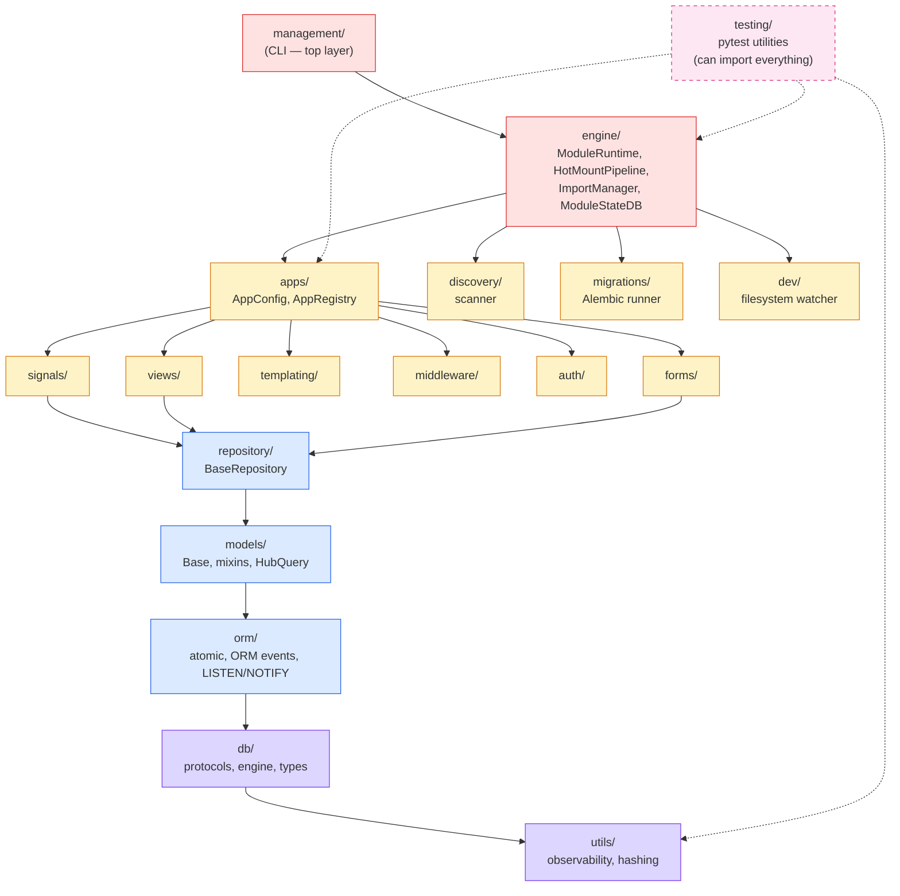
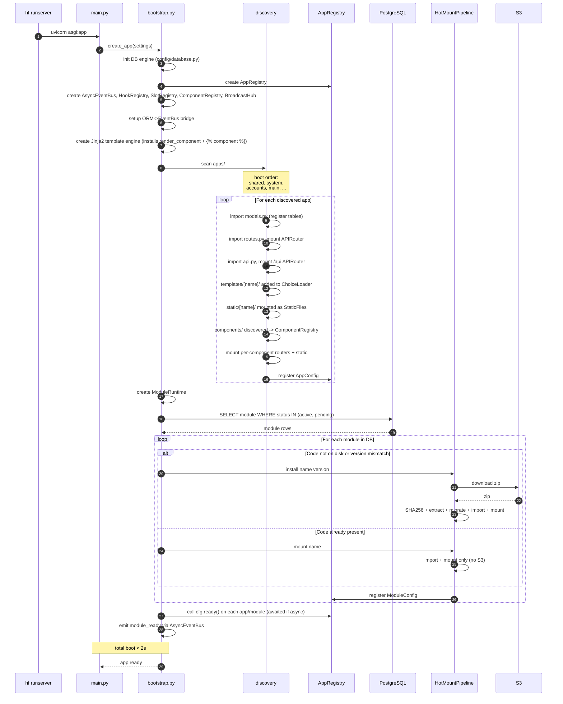
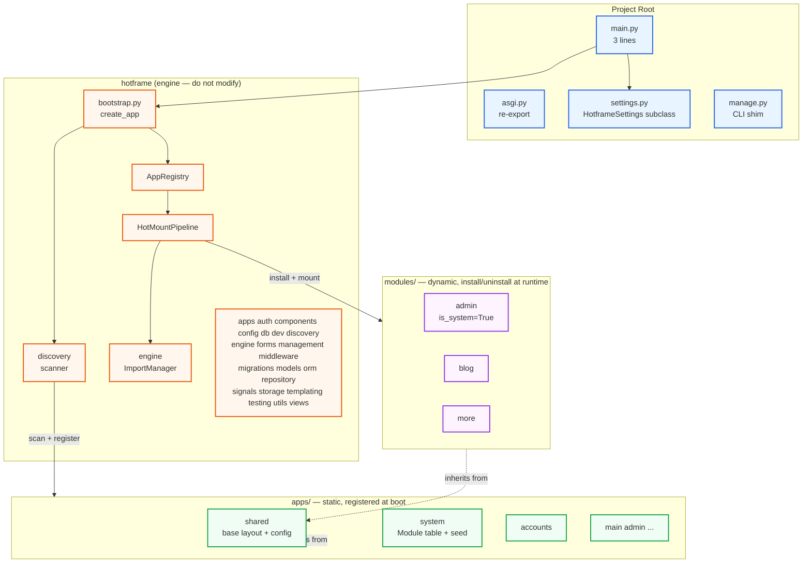
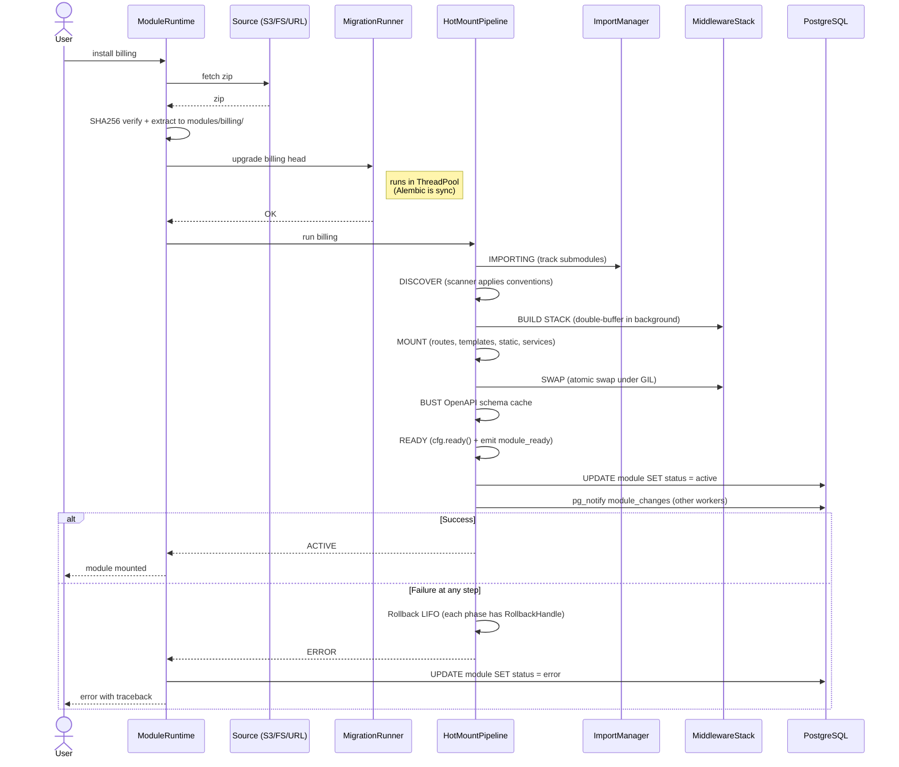
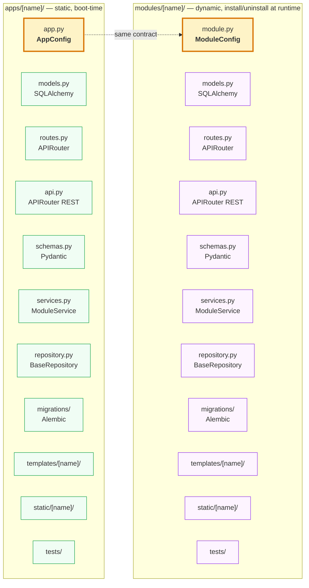

# Hotframe Architecture

This document describes the architecture of `hotframe`, a Python web framework for building modular applications with hot-mount dynamic modules.

---

## What is hotframe

`hotframe` is a Python framework that unifies **FastAPI + SQLAlchemy + Alembic + Jinja2 + HTMX + Alpine.js + Typer + Pydantic** under a Django-like ergonomics, adding a **dynamic hot-mount module engine** (load/unload plugins without restarting the process). Pydantic powers settings, form rendering, and typed component props.

Current version: **0.0.5**.

### Inspired by

| System | What we took |
|--------|--------------|
| Django | `AppConfig`, `manage.py`, app system, `startapp`/`startproject` scaffolder, layout conventions |
| Rails Turbo | Named frames, Turbo Streams, morphing, broadcasting by topic |
| Laravel Livewire | Server-driven UI, view decorators, inline validation |
| Odoo | DB-backed module registry as source of truth, topological sort dependencies |
| WordPress | Plugin hooks (actions/filters) — here `signals/` |

### What hotframe is NOT

- Not an ORM (uses SQLAlchemy 2.0 as-is).
- Not a frontend framework (delegates to HTMX + Alpine.js).
- Not a task runner (uses APScheduler/Celery/SQS by configuration).
- Not an asset builder (no webpack/vite; modules serve static files directly).

### Installation

```bash
pip install hotframe
hf startproject my_app
cd my_app
hf startapp accounts
hf startmodule blog
hf runserver
```

The CLI installs two aliases: `hf` (short) and `hotframe` (explicit).

---

## Key Principles

1. **One public API.** Import everything from `hotframe`, not from internal submodules. `import-linter` enforces this.
2. **Apps are auto-discovered.** `apps/*/routes.py` and `apps/*/api.py` are mounted at boot with zero config — no `INSTALLED_APPS`, no manual `include_router` calls.
3. **Modules are dynamic.** Install, update, activate, deactivate, and uninstall at runtime without restarting.
4. **`main.py` is 3 lines.** `create_app` + `settings` import + `app =` assignment. All logic lives in `settings.py`.
5. **`settings.py` is the only config file.** Static files, media, CORS, middleware, modules, auth — all in one place.
6. **Each app/module is self-contained.** Templates, static assets, migrations, and tests live inside the app/module directory.
7. **HTMX + Alpine.js for frontend.** No React, no Vue, no build step.
8. **Server-driven UI.** HTML over the wire, not JSON APIs.

---

## Architecture Layers

### Runtime Layer (hotframe engine)

The immutable core framework. Once stable, it does not change. Contains no business logic.

- `bootstrap.py` — `create_app(settings)`: builds the FastAPI app, wires middleware, discovers apps, starts lifespan
- `apps/` — `AppConfig`, `ModuleConfig`, registry, service facade
- `engine/` — `ModuleRuntime`, `HotMountPipeline`, `ImportManager`, `ModuleStateDB`
- `discovery/` — auto-scanner for `apps/*/routes.py`, `apps/*/api.py`, kernel modules
- `middleware/` — 14 middleware classes + stack builder
- `templating/` — Jinja2 engine with dynamic loader, HTMX helpers, Alpine helpers, slots, frame extension, icons
- `components/` — `ComponentRegistry`, `Component` (Pydantic), Jinja2 `render_component` global + `` tag, discovery for `apps/<app>/components/` and `modules/<id>/components/`, per-component router and static mounting
- `signals/` — `AsyncEventBus`, `HookRegistry`, typed events

### App Layer (static, boot-time)

Apps live in `apps/`. Discovered and mounted once at startup. Cannot be unloaded at runtime.

- Each app has an `app.py` with `AppConfig`
- Routes auto-discovered from `routes.py` and `api.py`
- Models, migrations, templates, static assets are self-contained

### Module Layer (dynamic, runtime)

Modules live in `modules/`. Installed, mounted, and unmounted at runtime via `ModuleRuntime`. State persisted in DB.

- Each module has a `module.py` with `ModuleConfig`
- Same file conventions as apps (`routes.py`, `api.py`, `models.py`, etc.)
- Mounted dynamically by `HotMountPipeline` without restarting the process

### HTMX Layer (server-driven UI)

Sits on top of the view layer. Provides:
- `@htmx_view` decorator — handles full vs partial render, auth, permissions
- `TurboStream` / `StreamResponse` — multi-fragment OOB responses
- `sse_stream` / `BroadcastHub` — real-time server-sent events
- `SlotRegistry` — cross-module UI injection (modules push contributions into named extension points)
- `ComponentRegistry` — reusable UI widgets (consumer template pulls one named widget into its markup)
- Jinja2 helpers: `hx_get`, `hx_post`, `hx_delete`, `alpine_data`, ``, `render_component()`, ``

---

## Project Layout

```
myproject/
  main.py                  # from hotframe import create_app; app = create_app(settings)
  asgi.py                  # from main import app  (Uvicorn entry point)
  settings.py              # class Settings(HotframeSettings): ...
  manage.py                # shim → hotframe.management.cli
  pyproject.toml

  apps/
    shared/                # base templates, static assets, global config
      app.py               # AppConfig (early boot)
      routes.py            # APIRouter
      templates/shared/    # base.html, app_base.html, page_base.html
      static/shared/       # global CSS/JS, logos, icons
      components/          # scaffolded by hf startproject (alert, badge)
        alert/
          component.py     # optional — Pydantic Component subclass
          template.html    # required — Jinja2 template
          routes.py        # optional — APIRouter mounted at /_components/alert/
          static/          # optional — /_components/alert/static/...
        badge/
          template.html
    accounts/
      app.py
      models.py            # User, Role (SQLAlchemy)
      routes.py            # APIRouter (HTMX views)
      api.py               # APIRouter (REST endpoints)
      schemas.py           # Pydantic schemas
      services.py          # ModuleService subclasses
      repository.py        # BaseRepository subclasses
      migrations/          # Alembic revisions
      templates/accounts/
      static/accounts/
    system/                # core runtime tables: Module, ModuleVersion
      app.py
      models.py
      migrations/          # creates module table + seeds system modules

  modules/
    blog/
      module.py            # class BlogModule(ModuleConfig)
      models.py
      routes.py
      api.py
      schemas.py
      services.py
      repository.py
      migrations/
      templates/blog/
      static/blog/
      components/          # optional — module-scoped components (hot-unloaded)
      tests/

  static/                  # served at STATIC_URL if directory exists
  tests/                   # E2E cross-app tests
```

No global `templates/`, `static/`, `locales/`, or `migrations/` at the project root. Everything lives inside the app or module that owns it.

---

## Package Structure

Internal `src/hotframe/` packages and what they contain:

```
src/hotframe/
  __init__.py          <- public API: lazy re-exports (see "Public API")
  bootstrap.py         <- create_app(settings), _auto_discover_apps, lifespan

  apps/                <- AppConfig, ModuleConfig, AppRegistry, service_facade
  auth/                <- session, password (bcrypt), JWT, CSRF, CSP, permissions, user resolution
  components/          <- ComponentRegistry, Component (Pydantic), discovery,
                          Jinja2 render_component +  tag,
                          per-component router and static mounting
  config/              <- HotframeSettings (Pydantic), DB engine factory, paths
  db/                  <- singletons, encrypted types (Fernet), protocols (ISession etc.)
  dev/                 <- autoreload watcher (ModuleWatcher)
  discovery/           <- app/module scanner, kernel module bootstrap
  engine/              <- ModuleRuntime, HotMountPipeline, ImportManager,
                          ModuleStateDB, S3ModuleSource, MarketplaceClient,
                          DependencyManager
  forms/               <- FormRenderer (Pydantic -> HTML)
  management/          <- CLI (Typer): hf startproject, startapp, startmodule, shell, modules, etc.
  middleware/          <- 14 middleware classes + MiddlewareStackManager
  migrations/          <- Alembic runner (single + multi-namespace); no migrations here
  models/              <- Base, Model, HubBaseModel, mixins, HubQuery
  orm/                 <- atomic(), ORM->EventBus bridge, PG LISTEN/NOTIFY
  repository/          <- BaseRepository (typed CRUD)
  signals/             <- AsyncEventBus, HookRegistry, typed events, catalog
  storage/             <- MediaStorage (local + S3 backends)
  templating/          <- Jinja2 engine, HTMX helpers, Alpine helpers,
                          slots, frame extension, icons, filters
  testing/             <- create_test_app, FakeEventBus, FakeHookRegistry
  utils/               <- observability: logging, metrics (Prometheus), telemetry (OTEL)
  views/               <- @htmx_view, TurboStream, StreamResponse, SSE, BroadcastHub
```

Dependency rule: lower layers never import from higher layers. `import-linter` validates this in CI.



---

## Bootstrap Sequence

`main.py` is always 3 lines:

```python
from hotframe import create_app
from settings import settings
app = create_app(settings)
```

### What `create_app` does (sync phase, before startup)

1. Setup logging + OpenTelemetry
2. Create `FastAPI` app with lifespan
3. Build middleware stack from `settings.MIDDLEWARE`
4. Optional `ProxyFixMiddleware` (if `PROXY_FIX_ENABLED`)
5. Mount `CORSMiddleware` if `CORS_ORIGINS` is non-empty
6. **Auto-discover apps** — scan `apps/*/routes.py` and `apps/*/api.py`, mount all routers (zero config, no `INSTALLED_APPS`)
7. Mount any routers listed in `EXTRA_ROUTERS`
8. Include broadcast router (SSE)
9. Add `/health` endpoint
10. Register error handlers (401 redirect, 403/405 template)
11. Mount `StaticFiles` at `STATIC_URL` if `STATIC_ROOT` exists
12. Mount media files at `MEDIA_URL` in dev (`MEDIA_STORAGE=local`)

### Lifespan startup



During lifespan startup, `app.state` is populated with `event_bus`, `hooks`, `slots`, `components` (a `ComponentRegistry`), `broadcast_hub`, and `module_runtime`. `AppConfig.ready()` and `ModuleConfig.ready()` are called per app/module; if `ready` is declared `async def`, hotframe detects the coroutine function via `inspect.iscoroutinefunction` and awaits it — sync `ready` is still called directly.

### Shutdown

1. `ModuleRuntime.shutdown()`
2. Dispose DB engine

---

## Module Lifecycle

### High-level view



### Module states

`NOT_INSTALLED` -> `INSTALLING` -> `ACTIVE` -> `DISABLED` -> `UNINSTALLED`

Error path: any state -> `ERROR` (traceback persisted, operator decides)

### HotMountPipeline install flow



**Target times:**
- Cold install (S3, run migrations): < 2s
- Warm mount (code on disk, skip download): < 500ms

### `ModuleRuntime` API

```python
# Accessible at runtime via request.app.state.module_runtime
runtime: ModuleRuntime = request.app.state.module_runtime

await runtime.install(module_id, source=None)    # name, .zip path, URL, or marketplace
await runtime.activate(module_id)                # disabled -> active
await runtime.deactivate(module_id)              # active -> disabled
await runtime.uninstall(module_id)               # remove
await runtime.update(module_id, source=None)     # update with backup + auto-rollback on failure
```

Source resolution order: URL -> `.zip` path -> `MODULE_MARKETPLACE_URL` -> `modules/` directory.

---

## App and Module Contract

Apps and modules follow the same file conventions. The only difference is the entry point name (`app.py` vs `module.py`) and the lifecycle (static vs dynamic).



**Convention:** files are detected by name. If present, they are processed. If absent, they are skipped. Only `app.py` / `module.py` is required.

### How routing works

Apps and modules use standard FastAPI `APIRouter`. There is no `path()`, `include()`, or `urlpatterns`.

**`apps/accounts/routes.py`:**
```python
from fastapi import APIRouter
from . import views

router = APIRouter()

router.get("/login")(views.login)
router.get("/profile")(views.profile)
```

**`apps/accounts/api.py`:**
```python
from fastapi import APIRouter

api_router = APIRouter(prefix="/api/accounts")

@api_router.get("/me")
async def me(): ...
```

The discovery scanner looks for `router` in `routes.py` and `api_router` in `api.py`. Both are mounted automatically at boot (for apps) or at hot-mount time (for modules).

### AppConfig

```python
from hotframe import AppConfig

class AccountsConfig(AppConfig):
    name = "accounts"
    label = "Accounts"
    mount_prefix = "/accounts"

    def ready(self):
        from . import signals  # noqa — connect event bus listeners
```

### ModuleConfig

```python
from hotframe import ModuleConfig

class BlogModule(ModuleConfig):
    module_id = "blog"
    has_views = True     # mounts routes.py
    has_api = True       # mounts api.py

    async def install(self, ctx): ...    # initial seeding
    async def uninstall(self, ctx): ... # idempotent cleanup

    def ready(self):
        from . import signals  # noqa
```

---

## Public API

All 64 symbols are importable from `from hotframe import X`. Never import from internal submodules.

### Bootstrap

| Symbol | Description |
|--------|-------------|
| `create_app` | Build and return the FastAPI application |

### Settings

| Symbol | Description |
|--------|-------------|
| `HotframeSettings` | Base Pydantic settings class; subclass in `settings.py` |
| `get_settings` | Dependency that returns the current settings instance |

### Apps

| Symbol | Description |
|--------|-------------|
| `AppConfig` | Base class for static apps |
| `ModuleConfig` | Base class for dynamic modules |

### Models

| Symbol | Description |
|--------|-------------|
| `Base` | SQLAlchemy `DeclarativeBase` |
| `Model` | `Base` + `HubMixin` + `TimestampMixin` convenience alias |
| `HubBaseModel` | Base with hub isolation |
| `TimeStampedModel` | Base + `TimestampMixin` |
| `ActiveModel` | Base + `SoftDeleteMixin` |
| `HubMixin` | Adds `hub_id` column + auto-filter |
| `TimestampMixin` | `created_at`, `updated_at` |
| `AuditMixin` | `created_by`, `updated_by` |
| `SoftDeleteMixin` | `deleted_at`, `is_deleted` |
| `HubQuery` | Chainable async query builder implementing `IQueryBuilder` |

### Repository

| Symbol | Description |
|--------|-------------|
| `BaseRepository` | Generic typed CRUD repository (list, get, create, update, delete, count, exists) |

### DB Protocols

| Symbol | Description |
|--------|-------------|
| `ISession` | Abstract async session (execute, add, flush, commit, rollback, delete) |
| `IQueryBuilder` | Abstract chainable query builder |
| `IRepository` | Abstract typed CRUD repository |
| `IExecuteResult` | Abstract result of `session.execute()` |
| `IScalarResult` | Abstract result of `result.scalars()` |

### Signals

| Symbol | Description |
|--------|-------------|
| `AsyncEventBus` | Async pub/sub bus: `subscribe(event_name, handler)`, `emit(event_name, **data)` |
| `HookRegistry` | WordPress-style hooks: `add_action`, `do_action`, `add_filter`, `apply_filters` |
| `BaseEvent` | Pydantic base class for typed events |
| `register_event` | Decorator to register a typed event in the catalog |

### ORM

| Symbol | Description |
|--------|-------------|
| `setup_orm_events` | Wire SQLAlchemy mapper events -> `AsyncEventBus` auto-emit on save/delete |

### Views

| Symbol | Description |
|--------|-------------|
| `htmx_view` | Decorator: auth, permissions, full/partial render, template auto-discovery |
| `is_htmx_request` | Returns `True` if `HX-Request` header is present |
| `htmx_redirect` | Response with `HX-Redirect` header |
| `htmx_refresh` | Response with `HX-Refresh: true` header |
| `htmx_trigger` | Response with `HX-Trigger` header |
| `add_message` | Flash message (HTMX or session-based) |
| `sse_stream` | Generator helper for server-sent events |
| `TurboStream` | Build a single OOB stream fragment |
| `StreamResponse` | Combine multiple `TurboStream` instances into one response |
| `BroadcastHub` | Pub/sub hub for SSE topics |

### Templating

| Symbol | Description |
|--------|-------------|
| `SlotRegistry` | Cross-module UI injection: `register(slot, template, module_id, priority)` |

### Components

| Symbol | Description |
|--------|-------------|
| `Component` | Pydantic base class for Python-declared components (typed props + optional `context()`) |
| `ComponentEntry` | Dataclass describing a registered component (name, template path, props class, module_id) |
| `ComponentRegistry` | In-memory registry of components; an instance lives on `app.state.components` |

### Auth

| Symbol | Description |
|--------|-------------|
| `get_session_user_id` | Extract user ID from signed session cookie |
| `hash_password` | Bcrypt hash |
| `verify_password` | Bcrypt verify |
| `has_permission` | `fnmatch`-based permission check |
| `require_permission` | FastAPI dependency — raises 403 if denied |

### Dependencies (FastAPI `Depends`)

| Symbol | Type | Description |
|--------|------|-------------|
| `DbSession` | `Annotated[ISession, Depends(get_db)]` | Async DB session |
| `CurrentUser` | `Annotated[UserModel, Depends(get_current_user)]` | Authenticated user (raises 401 if not logged in) |
| `OptionalUser` | `Annotated[UserModel | None, ...]` | User or `None` |
| `EventBus` | `Annotated[AsyncEventBus, ...]` | Event bus from `app.state` |
| `Hooks` | `Annotated[HookRegistry, ...]` | Hook registry from `app.state` |
| `Slots` | `Annotated[SlotRegistry, ...]` | Slot registry from `app.state` |
| `get_db` | Callable | Low-level session factory (prefer `DbSession`) |
| `get_current_user` | Callable | Low-level user resolver (prefer `CurrentUser`) |

### Services

| Symbol | Description |
|--------|-------------|
| `ModuleService` | Base class for service objects; receives `db: ISession`, `q()`, `repo()` |
| `action` | Decorator to expose a service method as a named action |

### Engine

| Symbol | Description |
|--------|-------------|
| `ModuleStateDB` | CRUD on the `module` table (status, version, metadata) |
| `HotMountPipeline` | Executes the install/mount phases with per-phase rollback |
| `ImportManager` | Manages Python module import/purge, submodule tracking, zombie verification |
| `MarketplaceClient` | HTTP client for the module marketplace |

### Forms

| Symbol | Description |
|--------|-------------|
| `FormRenderer` | Render Pydantic models as HTML form fields |

### Config

| Symbol | Description |
|--------|-------------|
| `get_engine` | Returns the SQLAlchemy `AsyncEngine` singleton |
| `get_session_factory` | Returns the `async_sessionmaker` singleton |

### Storage

| Symbol | Description |
|--------|-------------|
| `MediaStorage` | File storage abstraction (local filesystem or S3) |
| `get_media_storage` | Returns the configured `MediaStorage` instance |

---

## HTMX Layer

### `@htmx_view` decorator

```python
from fastapi import APIRouter
from hotframe import htmx_view

router = APIRouter()

@router.get("/m/todo/list/")
@htmx_view(module_id="todo", view_id="list", permissions="todo.view")
async def todo_list(request):
    return {"todos": await get_todos(), "page_title": "Todos"}
```

What the decorator handles:
- Auth check (redirects to `AUTH_LOGIN_URL` if unauthenticated)
- Permission check (raises 403 if denied)
- `HX-Request` detection: renders full page on direct navigation, partial on HTMX request
- Template auto-discovery: `{module}/partials/{view}.html` (partial), `{module}/pages/{view}.html` (full)
- Return a dict -> auto-rendered to template; return a `Response` -> passed through as-is

### TurboStream (multi-fragment responses)

```python
from hotframe import TurboStream, StreamResponse

return StreamResponse(
    TurboStream.append("#todo-list", html=rendered_item),
    TurboStream.text("#todo-count", str(count)),
    TurboStream.remove("#empty-state"),
)
```

Actions: `append`, `prepend`, `replace`, `update`, `remove`, `before`, `after`, `morph`, `text`

### Broadcasting (real-time SSE)

```python
# Publish to a topic
hub = get_broadcast_hub(request)
await hub.publish("todos", TurboStream.append("#list", html=item_html).to_oob_html())

# Subscribe in template
{{ stream_from("todos") }}
```

Endpoints:
- Single topic: `GET /stream/{topic}`
- Multiplexed: `GET /stream/_mux?topics=a,b,c`
- WebSocket: `/ws/stream/{topic}`

### Jinja2 HTMX helpers

```html
<!-- GET request with inline search -->
<input {{ hx_get(url_for('search'), trigger="input changed delay:300ms", target="#results") }}>

<!-- POST with swap -->
<form {{ hx_post(url_for('todo.create'), target="#list", swap="beforeend") }}>

<!-- DELETE with confirmation -->
<button {{ hx_delete(url_for('todo.delete', id=todo.id), confirm="Are you sure?") }}>
```

All helpers: `hx_get`, `hx_post`, `hx_put`, `hx_patch`, `hx_delete`, `hx_trigger`, `hx_indicator`, `hx_vals`

### Jinja2 Alpine helpers

```html
<div {{ alpine_data({"count": 0, "open": false}) }}>
<div {{ alpine_show("count > 0") }} {{ alpine_cloak() }}>
```

### `` tag (Turbo Frames equivalent)

```html

    <div class="skeleton"></div>

```

Parameters: `src`, `lazy`, `swap`, `trigger`, `target`, `push_url`

### SlotRegistry (cross-module UI injection)

```python
# Module registers a slot contribution
slots.register("dashboard_widgets", "loyalty/partials/widget.html", module_id="loyalty", priority=5)
```

```html
<!-- Template renders all slot contributions -->

    

```

### Flash messages

```python
add_message(request, "success", "Item created")
# HTMX: injected as HX-Trigger: {"showMessages": [...]}
# Non-HTMX: stored in session flash for next page load
```

### Template auto-injection

Every `TemplateResponse` automatically receives:
- `csrf_token` — raw token string
- `csrf_input()` — callable returning a hidden `<input>` element
- `csp_nonce` — CSP nonce for the current request

No manual context passing needed. Typical base template:

```html
<body hx-boost="true" hx-headers='{"X-CSRF-Token": "{{ csrf_token }}"}'>
```

### Jinja2 filters

| Filter | Example | Output |
|--------|---------|--------|
| `currency` | `{{ 9.99 | currency("EUR") }}` | 9,99 EUR |
| `dateformat` | `{{ dt | dateformat("d/m/Y H:i") }}` | 17/04/2026 14:30 |
| `timesince` | `{{ dt | timesince }}` | 3 minutes |
| `truncatewords` | `{{ text | truncatewords(10) }}` | First ten words... |
| `slugify` | `{{ "Hello World" | slugify }}` | hello-world |

---

## Components Subsystem

Components are reusable server-rendered UI widgets — named, self-contained directories with an optional Pydantic props class, a required Jinja2 template, an optional `APIRouter`, and an optional `static/` directory. Where slots let modules **push** content into a named extension point, components let templates **pull** a named widget into their markup. Both registries coexist in `app.state`.

See [Components](./COMPONENTS.md) for the full author's guide.

### Two types

- **Template-only** — a single `template.html`. Props arrive as Jinja2 variables; defaults come from `| default(...)`.
- **Python-declared** — a `component.py` with a subclass of `hotframe.Component` (a Pydantic `BaseModel`). Props are typed fields with validation; an optional synchronous `context()` method returns derived template variables.

### Discovery paths

```
apps/<app>/components/<name>/
modules/<id>/components/<name>/
```

Hotframe itself does **not** ship framework built-in components. The framework stays HTML- and CSS-free so projects own their design system. `hf startproject` scaffolds two starter components under `apps/shared/components/` — `alert` and `badge` — as plain project files that can be kept, modified, or deleted freely.

### File layout per component

| File | Required | Purpose |
|------|----------|---------|
| `template.html` | Yes | Jinja2 template rendered by `render_component()` or ``. |
| `component.py` | No | Subclass of `Component` with typed props and optional `context()`. |
| `routes.py` | No | Module-level `router: APIRouter`. Auto-mounted under `/_components/<name>/`. |
| `static/` | No | Per-component static assets. Auto-served at `/_components/<name>/static/`. |

Directories starting with `.` or `_` are skipped (reserved for caches and framework internals).

### Render API

```jinja
{# Inline, no body #}
{{ render_component('badge', text='New', variant='primary') }}

{# With a body block, available in the template as {{ body }} #}

    <strong>Heads up.</strong> Stock is low.

```

Both the `render_component()` global and the `` tag are installed automatically by `create_template_engine`. Reserved HTML attributes (`class`, `type`, `for`) are passed via an `attrs={...}` dict since Jinja2 rejects them as kwargs.

### Router and static mounts

Each component's `routes.py` is mounted at `/_components/<name>/...` and tagged `component:<name>` in the OpenAPI schema. Its `static/` directory is served at `/_components/<name>/static/...`. Component routes flow through the normal middleware stack — CSRF, rate limiting, session, CSP — exactly like a route declared in `apps/<app>/routes.py`.

### Context isolation and the framework slice

Components render with an **isolated** context. Parent template locals do not leak in. Hotframe copies a fixed framework slice:

| Key | What it is |
|-----|------------|
| `request` | Current `starlette.requests.Request` |
| `csrf_token` | Current CSRF token string |
| `csp_nonce` | Per-request CSP nonce |
| `user` | Resolved current user (or `None`) |
| `is_htmx` | `True` when the request carries `HX-Request: true` |
| `current_path` | Request URL path |

Validated props (and anything returned by `context()`) are merged on top of the slice. Any other state must be passed as an explicit prop.

### Lifecycle

- **Boot** — `discover_app_components` scans every `apps/<app>/components/` and registers entries with `module_id=None`. Routers and static dirs are mounted immediately.
- **Module install/activate** — `discover_module_components` scans `modules/<id>/components/`. Routers and static dirs are installed into the running app via `mount_component_routers_for_module` and `mount_component_static_for_module`.
- **Module deactivate/uninstall** — the matching `unmount_component_routers_for_module` and `unmount_component_static_for_module` reverse the mounts, and `ComponentRegistry.unregister_module(module_id)` drops every entry owned by the module.

Name collisions log a warning and the second registration overwrites the first. This is intentional to support dev-time module reload.

### Public types

- `Component` — Pydantic base class for Python-declared components.
- `ComponentEntry` — dataclass describing a registered component (name, template path, props class, module_id).
- `ComponentRegistry` — in-memory registry; an instance lives on `app.state.components`.

---

## DB Protocols

hotframe decouples its public API from SQLAlchemy through `Protocol` classes (structural typing). App and module code should depend on these interfaces, not on `AsyncSession` directly.

| Protocol | What it abstracts | Default implementation |
|----------|-------------------|----------------------|
| `ISession` | Async DB session: execute, add, flush, commit, rollback, delete, transactions | `AsyncSession` (SQLAlchemy) |
| `IExecuteResult` | Result of `session.execute()`: scalars, scalar_one, first, all | `CursorResult` (SQLAlchemy) |
| `IScalarResult` | Result of `result.scalars()`: all, first | `ScalarResult` (SQLAlchemy) |
| `IQueryBuilder[T]` | Chainable async query builder: filter, order_by, limit, all, first, get, count | `HubQuery` |
| `IRepository[T]` | Typed CRUD: list, get, create, update, delete, count, exists | `BaseRepository` |

Defined in `hotframe/db/protocols.py`, re-exported from `hotframe/__init__.py`.

### Usage in services

```python
from hotframe import ModuleService, ISession

class OrderService(ModuleService):
    # self.db: ISession  (not AsyncSession)
    # self.q(Model) -> IQueryBuilder[Model]
    # self.repo(Model) -> IRepository[Model]

    async def get_pending(self):
        return await self.q(Order).filter(Order.status == "pending").all()
```

### Usage in routes

```python
from hotframe import DbSession

@router.get("/items")
async def list_items(db: DbSession):
    # db is typed as ISession — no SQLAlchemy import in route code
    result = await db.execute(select(Item))
    return result.scalars().all()
```

### What is NOT abstracted

Models (`DeclarativeBase`, `mapped_column`), migrations (Alembic), ORM events (`orm/events.py`), `PgNotifyBridge` (`orm/listeners.py`), and custom types (`EncryptedString`, `EncryptedText`) remain SQLAlchemy-specific. The protocols abstract the session and query layer, not the schema definition layer.

---

## CLI Commands

Two aliases: `hf` (short) and `hotframe` (explicit).

```bash
# Scaffolding
hf startproject <name>              # create project scaffold (use . for current directory)
hf startapp <name>                  # create app scaffold in apps/
hf startmodule <name>               # create module scaffold in modules/
hf startmodule <name> --api-only    # API-only module (no views/templates)
hf startmodule <name> --system      # system/kernel module (no hub isolation)

# Module management
hf modules list                     # show all modules and their status
hf modules install <source>         # source: name, .zip path, URL, or marketplace id
hf modules update <source>          # update with backup + auto-rollback on failure
hf modules activate <name>          # disabled -> active
hf modules deactivate <name>        # active -> disabled
hf modules uninstall <name>         # remove (flags: --keep-data, --yes)

# Development
hf runserver                        # uvicorn with autoreload
hf migrate                          # alembic upgrade head (all namespaces)
hf makemigrations                   # alembic revision --autogenerate
hf shell                            # interactive REPL with app context loaded
hf version                          # show hotframe version
```

`hf startproject .` scaffolds into the current directory instead of a subdirectory. The scaffold also seeds starter components in `apps/shared/components/` (`alert`, `badge`) — see [Components](./COMPONENTS.md).

`hf shell` drops you into an interactive Python REPL with `app`, `settings`, `db`, `events`, `hooks`, `slots`, `runtime`, and `SlotEntry` pre-loaded. It auto-detects IPython (install via `pip install "hotframe[shell]"`) and falls back to the built-in `code.interact()`. Flags: `--plain` (force built-in REPL), `--no-startup` (skip lifespan), `--settings=<dotted.path>` (override discovery). See [Shell](./SHELL.md).

---

## Performance Targets

| Operation | Target |
|-----------|--------|
| Full boot (core apps, no modules) | < 3s |
| Hot-mount new module (cold: S3 + migrate) | < 2s |
| Hot-mount existing module (warm: disk only) | < 500ms |
| Module uninstall (zombie classes after weakref check) | 0 |

---

## Observability

**Prometheus metrics:**
- `hotframe_module_install_duration_seconds{module, phase}`
- `hotframe_module_mount_errors_total{module, phase}`
- `hotframe_zombie_classes_total{module}` — alert if > 0 after 30s -> triggers graceful restart
- `hotframe_hot_mount_total{result}` — `success | error`

**OpenTelemetry:** span per pipeline phase with attributes `module.name`, `module.version`.

---

## What Does NOT Belong in `hotframe/`

| Does not go here | Lives in |
|-----------------|----------|
| Business model classes | `apps/<app>/models.py` |
| `settings.py` (Pydantic) | project root `settings.py` |
| `main.py`, `asgi.py` | project root (3 lines each) |
| Base layout templates | `apps/shared/templates/shared/` |
| Global static assets | `apps/shared/static/shared/` |
| All migrations | `apps/<app>/migrations/`, `modules/<module>/migrations/` |
| Domain integrations (payments, fiscal, CRM) | apps or modules |
| UI components with HTML/CSS (e.g. `alert`, `badge`) | `apps/<app>/components/`, scaffolded by `hf startproject` |
| Credentials, secrets | outside the repo (secrets manager) |

**Admission criterion:** if it disappears, the generic mechanism stops working (not just one application).
